# Credit Risk Data Preprocessing for Construction Companies

This document describes the step-by-step processing of the dataset for predicting default among construction companies.

**Initial data:** 229,212 rows, 23 columns

**Initial missing values:** 11.4% of all cells

**Final data:** 224,304 rows, 20 columns

**Final missing values:** 0.0%

**Unique companies (OGRN):** 38,780

**Time period:** 2012–2024

**Missing values by column (initial data):**

| Column | Missing count | Missing % |
|--------|--------------|-----------|
| Equity / Assets | 5,662 | 2.5% |
| Liabilities / Assets | 5,125 | 2.2% |
| Current Ratio | 10,702 | 4.7% |
| Quick Ratio | 10,702 | 4.7% |
| Cash / Current Liabilities | 17,908 | 7.8% |
| Working Capital / Assets | 7,387 | 3.2% |
| Short-term Liabilities / Total Liabilities | 8,880 | 3.9% |
| ROA | 12,779 | 5.6% |
| Net Margin | 29,677 | 12.9% |
| EBIT / Assets | 14,367 | 6.3% |
| Revenue / Assets | 25,792 | 11.3% |
| Receivables / Assets | 7,486 | 3.3% |
| Payables / Assets | 7,219 | 3.1% |
| Log(Assets) | 5,128 | 2.2% |
| Log(Revenue) | 28,656 | 12.5% |
| Retained Earnings / Assets | 78,113 | 34.1% |
| Cash Flow / Total Liabilities | 150,863 | 65.8% |
| Interest Coverage | 177,150 | 77.3% |

## Stage 1. Removing columns with excessive missing values

Three columns were removed due to high missing values:

- `Interest Coverage` (77.3% missing)
- `Cash Flow / Total Liabilities` (65.8% missing)
- `Retained Earnings / Assets` (34.1% missing)

**Justification:** These columns have systematic non-reporting (small construction companies rarely report interest expenses or cash flow statements). 

---

## Stage 2. Removing companies with only one year of data

Companies appearing in only one year were removed because panel methods require temporal variation.

- Companies removed: 1286
- Rows removed: 1286 (0.6%)

---

## Stage 3. Removing companies with gaps ≥3 years

Companies with a maximum gap of 3 or more consecutive missing years were removed.

**Justification:** A 3+ year gap represents economic discontinuity. Construction companies that disappear for 5 years have likely undergone major structural changes.

- Companies removed: 509
- Rows removed: 3622

---

## Stage 4a. Outlier treatment by columns

### Equity / Assets

**Economic meaning:** Shareholders' equity as a fraction of total assets. Measures financial cushion and solvency.

**Original statistics:**

```
min: -497.5000
max: 59.6000
mean: 0.1680
p1: -1.0394
p99: 1.0000
% below 0.0000: 10.4467%
% above 1.0000: 0.0238%
```

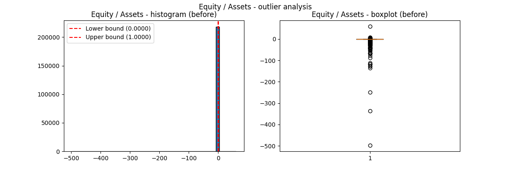

**Processing:**

Method: clip to [-1, 1]

**Justification:** Values < -1 indicate liabilities exceed assets by >100% - further negativity does not change default probability meaningfully. Values >1 are impossible (equity cannot exceed assets).

**Statistics after processing:**

```
min: -1.0000
max: 1.0000
mean: 0.2032
p1: -1.0000
p99: 1.0000
% clipped to -1.0000: 1.11%
% clipped to 1.0000: 1.09%
```

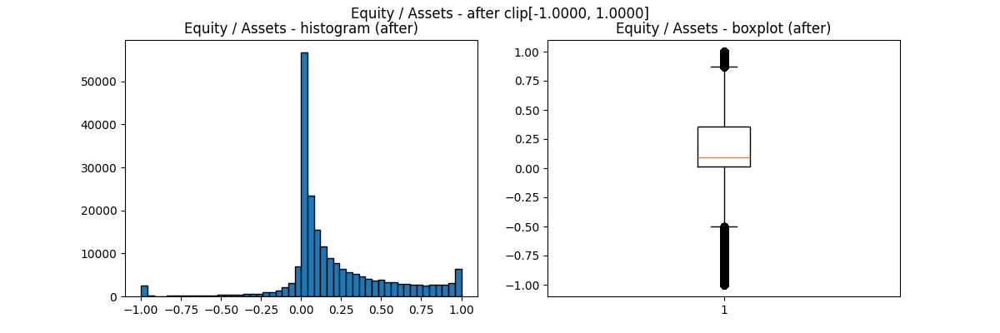

---

### Liabilities / Assets

**Economic meaning:** Total liabilities as a fraction of total assets. Measures financial leverage and debt burden.

**Original statistics:**

```
min: -6.0000
max: 891.3000
mean: 0.8444
p1: 0.0000
p99: 2.0423
% below 0.0000: 0.0192%
% above 2.0423: 1.0004%
```

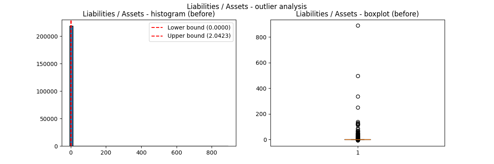

**Processing:**

Method: clip to [0, 2.0423]

**Justification:** 99% of Liabilities/Assets values fall within [0, 2.04]. Values outside this range are treated as extreme outliers and clipped to the nearest percentile bound.

**Statistics after processing:**

```
min: 0.0000
max: 2.0423
mean: 0.8054
p1: 0.0000
p99: 2.0423
% clipped to 0.0000: 1.63%
% clipped to 2.0423: 1.00%
```

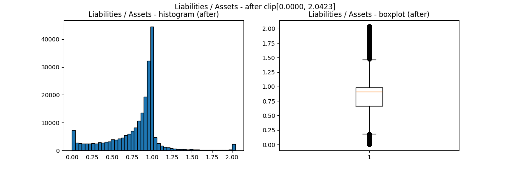

---

### Current Ratio

**Economic meaning:** Current assets / Current liabilities. Measures short-term liquidity and ability to pay obligations within one year.

**Original statistics:**

```
min: -261.5000
max: 17002.0000
mean: 3.6712
p1: 0.0430
p99: 53.8950
% below 0.0000: 0.0192%
% above 10.0000: 4.5515%
```

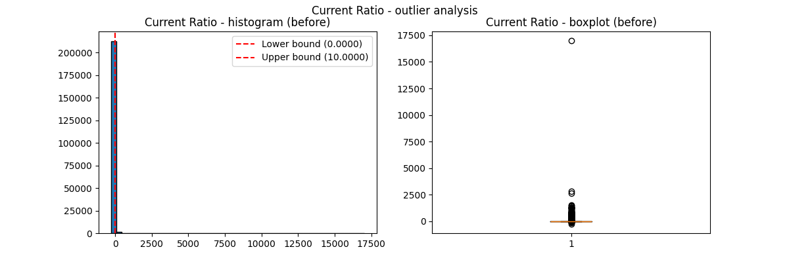

**Processing:**

Method: clip to [0, 10]

**Justification:** Current ratio cannot be negative. Values above 10 are extremely rare in construction industry and likely represent data errors. The [0, 10] range captures all economically plausible values while removing extreme outliers.

**Statistics after processing:**

```
min: 0.0000
max: 10.0000
mean: 1.8577
p1: 0.0430
p99: 10.0000
% clipped to 0.0000: 0.50%
% clipped to 10.0000: 4.61%
```

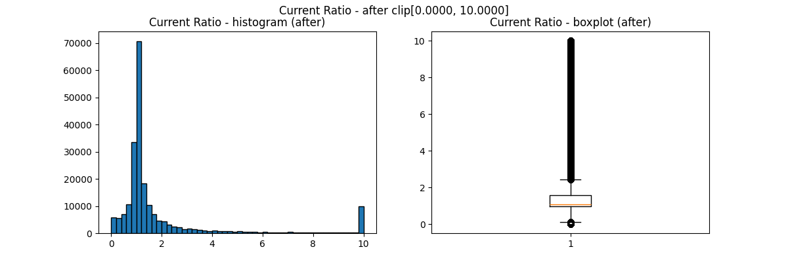

---

### Quick Ratio

**Economic meaning:** (Current assets - Inventory) / Current liabilities. A stricter liquidity measure that excludes hard-to-sell inventory.

**Original statistics:**

```
min: -154.0000
max: 17002.0000
mean: 2.9896
p1: 0.0076
p99: 44.0000
% below 0.0000: 0.0224%
% above 10.0000: 3.7214%
```

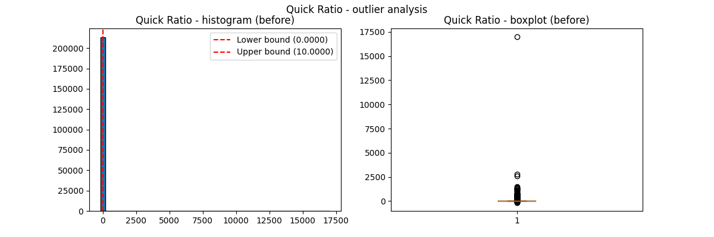

**Processing:**

Method: clip to [0, 10]

**Justification:** Quick ratio cannot be negative. Following the same logic as Current Ratio, values above 10 are extremely rare in construction industry. The [0, 10] range captures all economically plausible values.

**Statistics after processing:**

```
min: 0.0000
max: 10.0000
mean: 1.4808
p1: 0.0076
p99: 10.0000
% clipped to 0.0000: 0.86%
% clipped to 10.0000: 3.78%
```

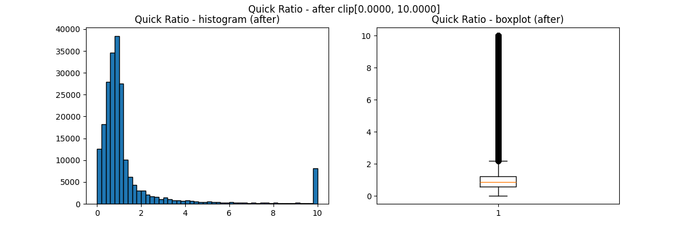

---

### Cash / Current Liabilities

**Economic meaning:** Cash / Current liabilities. The most conservative liquidity measure - only cash, no receivables or inventory.

**Original statistics:**

```
min: -100.2222
max: 818.0000
mean: 0.3944
p1: 0.0000
p99: 5.0000
% below 0.0000: 0.0435%
% above 5.0000: 0.9780%
```

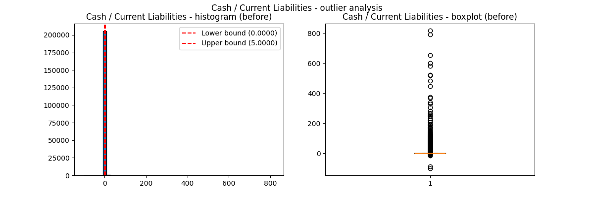

**Processing:**

Method: clip to [0, 5]

**Justification:** Cash ratio cannot be negative. Based on the 99th percentile (5.0), values above 5 are extremely rare and likely represent data errors. The [0, 5] range captures all economically plausible values.

**Statistics after processing:**

```
min: 0.0000
max: 5.0000
mean: 0.2100
p1: 0.0000
p99: 5.0000
% clipped to 0.0000: 29.75%
% clipped to 5.0000: 1.03%
```

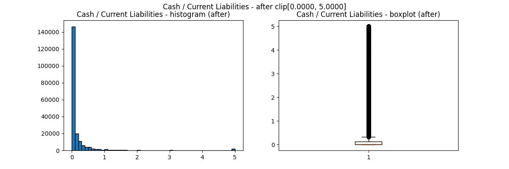

---

### Working Capital / Assets

**Economic meaning:** (Current assets - Current liabilities) / Total assets. Measures the proportion of assets financed by net working capital.

**Original statistics:**

```
min: -336.0000
max: 7.0000
mean: 0.0875
p1: -1.1271
p99: 0.9913
% below -1.0000: 1.1974%
% above 1.0000: 0.0111%
```

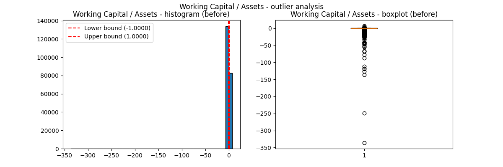

**Processing:**

Method: clip to [-1, 1]

**Justification:** Working capital rarely exceeds total assets in magnitude. Values outside [-1, 1] are likely data errors and are clipped to the nearest bound.

**Statistics after processing:**

```
min: -1.0000
max: 1.0000
mean: 0.1175
p1: -1.0000
p99: 0.9913
% clipped to -1.0000: 1.39%
% clipped to 1.0000: 0.83%
```

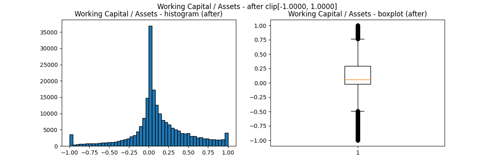

---

### Short-term Liabilities / Total Liabilities

**Economic meaning:** Short-term debt / Total debt. Measures the share of debt that matures within one year.

**Original statistics:**

```
min: -3.3500
max: 7.0000
mean: 0.8701
p1: 0.0074
p99: 1.0000
% below 0.0000: 0.0093%
% above 1.0000: 0.2161%
```

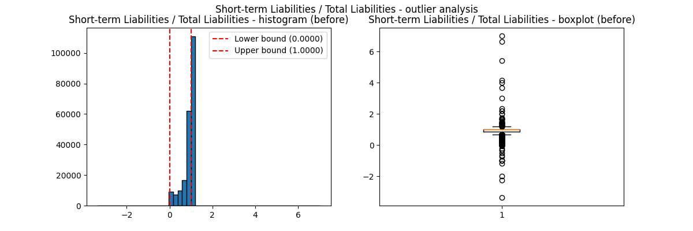

**Processing:**

Method: clip to [0, 1]

**Justification:** A fraction cannot be negative or exceed 1. Values outside [0, 1] are data errors.

**Statistics after processing:**

```
min: 0.0000
max: 1.0000
mean: 0.8699
p1: 0.0074
p99: 1.0000
% clipped to 0.0000: 0.75%
% clipped to 1.0000: 50.18%
```

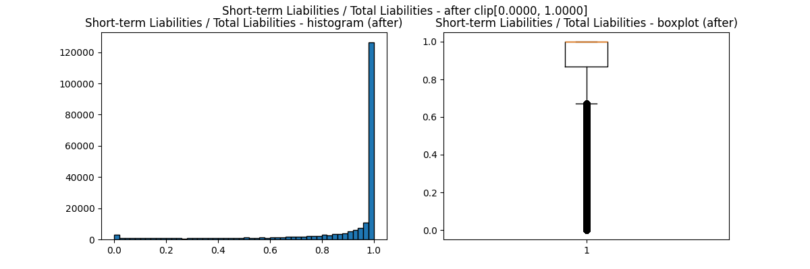

---

### ROA

**Economic meaning:** Net income / Total assets. Measures how efficiently a company uses its assets to generate profit.

**Original statistics:**

```
min: -113.1667
max: 43.7500
mean: 0.0417
p1: -0.4830
p99: 0.7143
% below -0.4830: 0.9999%
% above 0.7143: 0.9990%
```

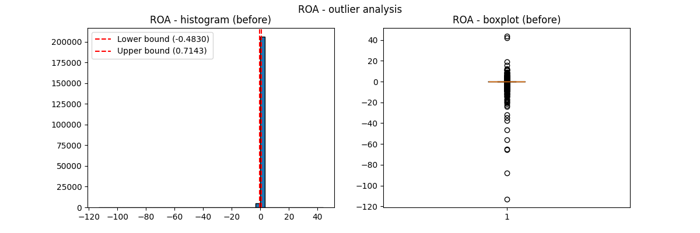

**Processing:**

Method: clip to [-0.483, 0.7143]

**Justification:** Based on data distribution, 98% of ROA values fall within [-0.4830, 0.7143]. Values outside this range are treated as extreme outliers and clipped to the nearest percentile bound.

**Statistics after processing:**

```
min: -0.4830
max: 0.7143
mean: 0.0492
p1: -0.4830
p99: 0.7143
% clipped to -0.4830: 1.00%
% clipped to 0.7143: 1.00%
```

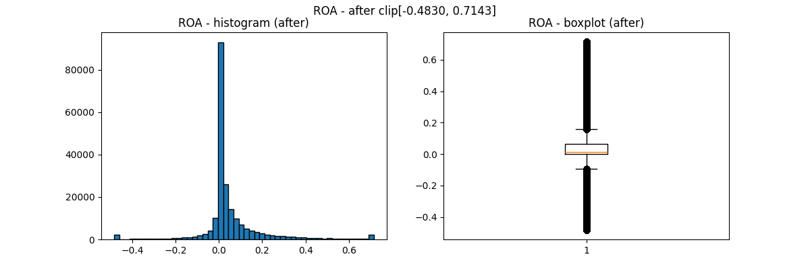

---

### Net Margin

**Economic meaning:** Net income / Revenue. Measures profit margin on sales.

**Original statistics:**

```
min: -11245.0000
max: 8499.0000
mean: -0.2423
p1: -3.5000
p99: 1.0000
% below -3.5000: 0.9865%
% above 1.0000: 0.8776%
```

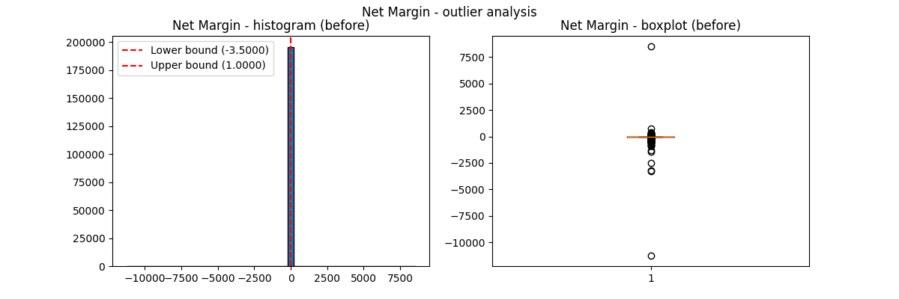

**Processing:**

Method: clip to [-3.5, 1.0]

**Justification:** Based on data distribution, 98% of Net Margin values fall within [-3.5000, 1.0000]. Values outside this range are treated as extreme outliers and clipped to the nearest percentile bound.

**Statistics after processing:**

```
min: -3.5000
max: 1.0000
mean: 0.0006
p1: -3.5000
p99: 1.0000
% clipped to -3.5000: 1.01%
% clipped to 1.0000: 1.17%
```

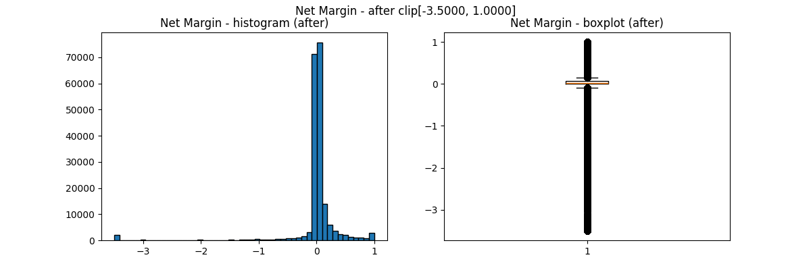

---

### EBIT / Assets

**Economic meaning:** EBIT / Total assets. Measures operating profitability before interest and taxes.

**Original statistics:**

```
min: -1012.6097
max: 132.8676
mean: 0.0516
p1: -0.4667
p99: 0.7974
% below -0.4667: 0.9989%
% above 0.7974: 1.0003%
```

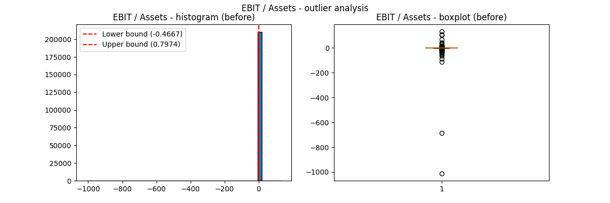

**Processing:**

Method: clip to [-0.4667, 0.7974]

**Justification:** Based on data distribution, 98% of EBIT/Assets values fall within [-0.4667, 0.7974]. Values outside this range are treated as extreme outliers and clipped to the nearest percentile bound.

**Statistics after processing:**

```
min: -0.4667
max: 0.7974
mean: 0.0649
p1: -0.4667
p99: 0.7974
% clipped to -0.4667: 1.00%
% clipped to 0.7974: 1.00%
```

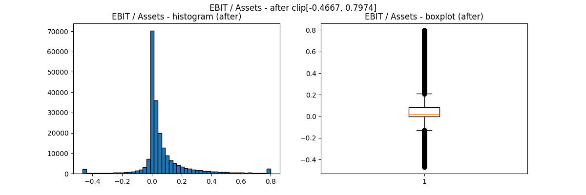

---

### Revenue / Assets

**Economic meaning:** Revenue / Total assets. Measures asset turnover efficiency - how much revenue each ruble of assets generates.

**Original statistics:**

```
min: -60.0000
max: 1544.9403
mean: 1.4510
p1: 0.0000
p99: 7.5833
% below 0.0000: 0.0105%
% above 10.0000: 0.5156%
```

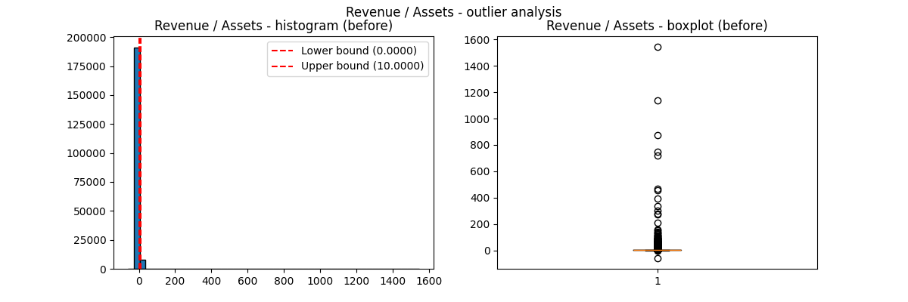

**Processing:**

Method: clip to [0, 10]

**Justification:** Asset turnover cannot be negative. Values above 10 are extremely rare in construction industry.

**Statistics after processing:**

```
min: 0.0000
max: 10.0000
mean: 1.3630
p1: 0.0000
p99: 7.5833
% clipped to 0.0000: 1.73%
% clipped to 10.0000: 0.54%
```

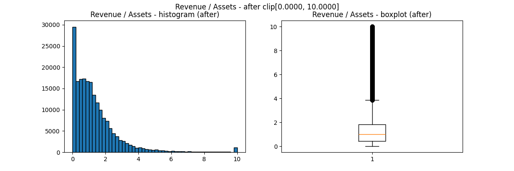

---

### Receivables / Assets

**Economic meaning:** Accounts receivable / Total assets. Measures the proportion of assets tied up in customer debt.

**Original statistics:**

```
min: -8.2581
max: 543.9000
mean: 0.4808
p1: 0.0000
p99: 1.0000
% below 0.0000: 0.0120%
% above 1.0000: 0.0194%
```

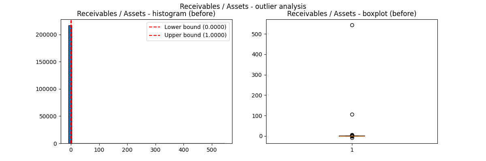

**Processing:**

Method: clip to [0, 1]

**Justification:** A fraction cannot be negative or exceed 1. Values outside [0, 1] are data errors.

**Statistics after processing:**

```
min: 0.0000
max: 1.0000
mean: 0.4778
p1: 0.0000
p99: 1.0000
% clipped to 0.0000: 1.97%
% clipped to 1.0000: 2.31%
```

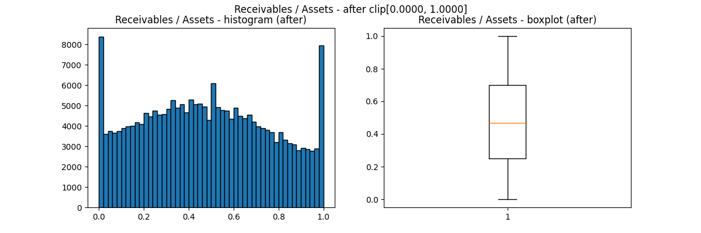

---

### Payables / Assets

**Economic meaning:** Accounts payable / Total assets. Measures the proportion of assets financed by trade credit.

**Original statistics:**

```
min: -0.6667
max: 700.0000
mean: 0.6411
p1: 0.0000
p99: 1.5000
% below 0.0000: 0.0083%
% above 1.0000: 4.4253%
```

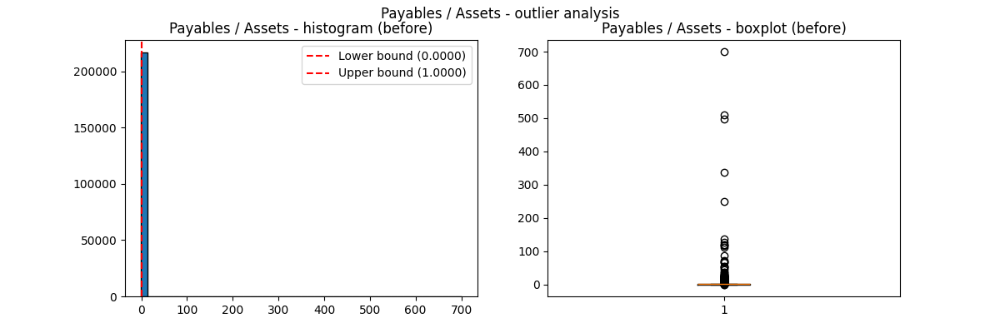

**Processing:**

Method: clip to [0, 1]

**Justification:** A fraction cannot be negative or exceed 1. Values outside [0, 1] are data errors.

**Statistics after processing:**

```
min: 0.0000
max: 1.0000
mean: 0.5989
p1: 0.0000
p99: 1.0000
% clipped to 0.0000: 2.63%
% clipped to 1.0000: 7.57%
```

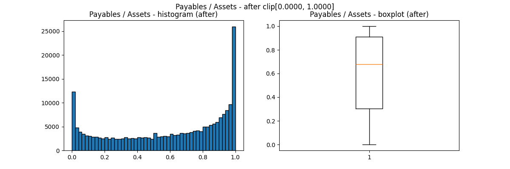

---

### Log(Assets)

**Economic meaning:** Natural logarithm of total assets. Measures company size.

**Original statistics:**

```
min: 0.0000
max: 16.5273
mean: 5.1181
p1: 0.6931
p99: 8.8372
% below 0.0000: 0.0000%
% above upper bound: no upper bound
```

_before.png)

**Processing:**

Method: clip to [0, ∞)

**Justification:** Logarithm is defined only for positive numbers. Values below 0 are impossible.

**Statistics after processing:**

```
min: 0.0000
max: 16.5273
mean: 5.1181
p1: 0.6931
p99: 8.8372
% clipped to 0.0000: 0.83%
% clipped to upper bound: no upper bound
```

_after.png)

---

### Log(Revenue)

**Economic meaning:** Natural logarithm of revenue. Measures company size by sales.

**Original statistics:**

```
min: 0.0000
max: 13.4008
mean: 4.8544
p1: 0.0000
p99: 8.6628
% below 0.0000: 0.0000%
% above upper bound: no upper bound
```

_before.png)

**Processing:**

Method: clip to [0, ∞)

**Justification:** Logarithm is defined only for positive numbers. Values below 0 are impossible.

**Statistics after processing:**

```
min: 0.0000
max: 13.4008
mean: 4.8544
p1: 0.0000
p99: 8.6628
% clipped to 0.0000: 1.59%
% clipped to upper bound: no upper bound
```

_after.png)

---

## Stage 4b. Balance sheet normalization

The accounting identity `Equity/Assets + Liabilities/Assets = 1` was violated in the original data. This occurs because financial statements may contain rounding errors, different accounting standards, or misreporting.

- Mean deviation before normalization: 0.023483
- Max deviation before normalization: 2.042300

**Solution:** Both ratios are divided by their sum for each row:

```
Equity/Assets_new = (Equity/Assets) / (Equity/Assets + Liabilities/Assets)
Liabilities/Assets_new = (Liabilities/Assets) / (Equity/Assets + Liabilities/Assets)
```

This ensures the sum equals 1 while preserving the relative proportion between equity and liabilities.

- Mean deviation after normalization: 0.000000
- Max deviation after normalization: 0.000000

---

## Stage 5. Handling missing values with panel structure

### 5.1 Conservative filling for first year

For each company, the first available year was filled with conservative (risk-increasing) values:

| Indicator | Conservative value | Economic justification |
|-----------|-------------------|------------------------|
| Equity / Assets | 0 | No equity → maximum risk |
| Liabilities / Assets | 1 | 100% debt financing |
| Current Ratio | 0.5 | Below standard liquidity |
| Quick Ratio | 0.3 | Below standard liquidity |
| Cash / Current Liabilities | 0 | No cash |
| Working Capital / Assets | -0.5 | Negative working capital |
| Short-term Liabilities / Total Liabilities | 1 | All debt is short-term |
| ROA | -0.1 | Moderate loss |
| Net Margin | -0.1 | Moderate loss |
| EBIT / Assets | -0.1 | Moderate loss |
| Revenue / Assets | 0 | No revenue |
| Receivables / Assets | 0 | No receivables/payables |
| Payables / Assets | 0 | No receivables/payables |
| Log(Assets) | 0 | Minimum size |
| Log(Revenue) | 0 | Minimum size |

### 5.2 Expanding to full panel

For each company, missing years within its actual min-max range were added.

- Original rows: 224,304
- Expanded rows: 225,963
- New rows added: 1,659

### 5.3 LOCF (Last Observation Carried Forward)

Missing years within a company's active period are created to obtain a balanced panel. For these added years, financial indicators are filled using the last available value from previous years.

Default flags are also forward-filled because default cannot occur in a missing year within a company's active period. If a company defaulted, it stops reporting, so no years after default are created.

**Result:** 0 missing values remaining in all columns.

---

## Stage 6. Final consistency checks

After all processing steps, we verify that the data satisfies logical and accounting constraints.

### 6.1 Balance sheet identity

Mean deviation: 0.000000, Max deviation: 0.000000

### 6.2 Liquidity ratios ordering

Quick Ratio > Current Ratio: 12 rows (0.0053%)
Cash > Quick Ratio: 132 rows (0.0584%)

### 6.3 Debt structure

Short-term Liabilities / Total Liabilities > 1: 0 rows (0.0000%)

### 6.4 Negative values

Equity / Assets < 0: 22,941 rows (10.15%) - economically possible (technical bankruptcy)
Liabilities / Assets < 0: 4 rows
Current Ratio < 0: 0 rows
Quick Ratio < 0: 0 rows
Cash / Current Liabilities < 0: 0 rows

### 6.5 Asset composition

Receivables / Assets > 1: 0 rows (0.0000%)
Payables / Assets > 1: 0 rows (0.0000%)

### 6.6 Profitability sign consistency

ROA and Net Margin opposite signs: 3,927 rows (1.74%)

---

## Conclusion

The data has been cleaned. Missing values are filled, outliers are capped, and the panel is balanced within each company's actual years. The final dataset contains 224,304 rows with no missing values. All financial ratios are within plausible ranges. The data is ready for modeling.

---

